# Run Locally First Time

Clone the project

```bash
  git clone https://github.com/ChiragOnGitHub/ChatApp.git
```

Go to the project directory

```bash
  cd ChatApp
```

Install dependencies

```bash
  npm install
  cd server
  npm install
```

Go back to the project directory

```bash
  cd ..
```

Start the Website

```bash
  npm run dev
```

# Demo
Screenshots of the website :-

Home page which have an animation created using react-animation-type
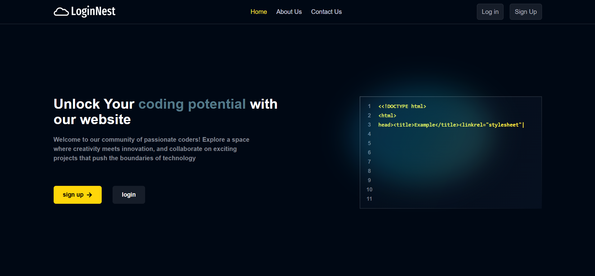

About us page will contain information about website for future purpose
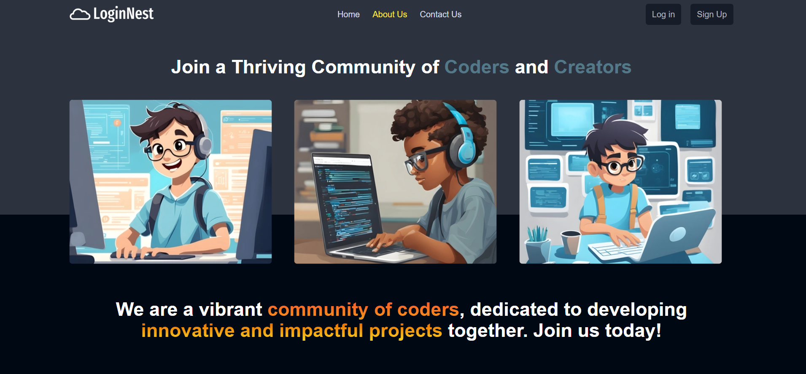

Contact Us Page. It will send confirmation mail to the user using node-mailer after receiving message.
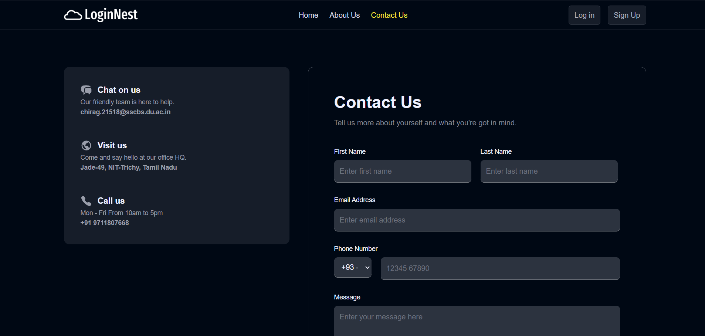

Sign Up Page which handles all user error with appropriate toast and send otp to the user.
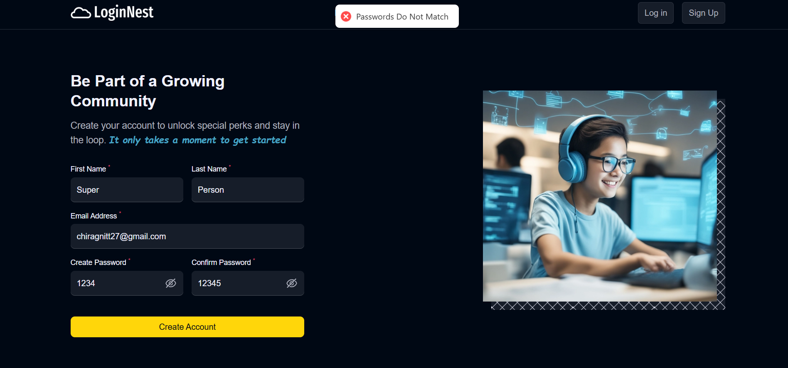
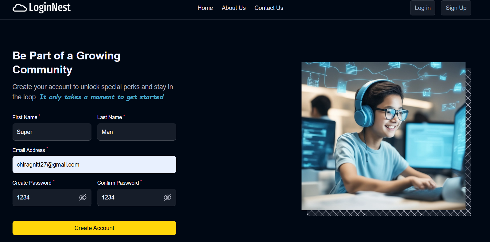

Loading Page
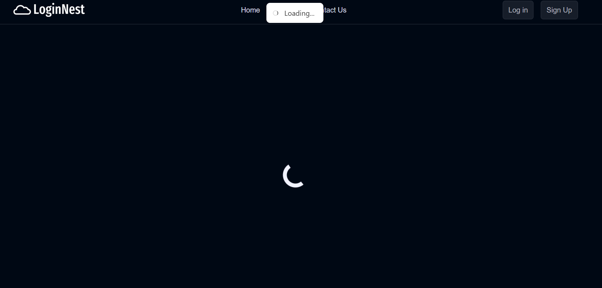

OTP page
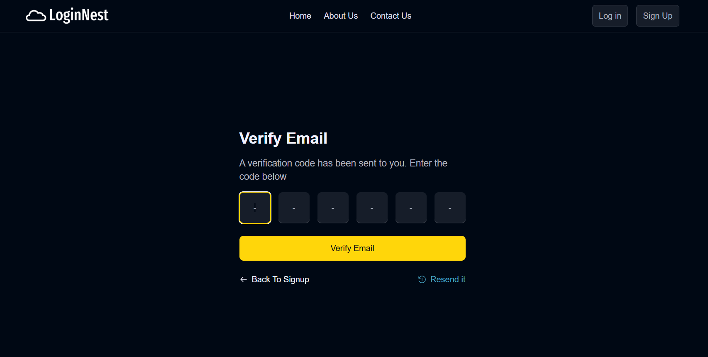

That's How OTP is visible to user in their mail
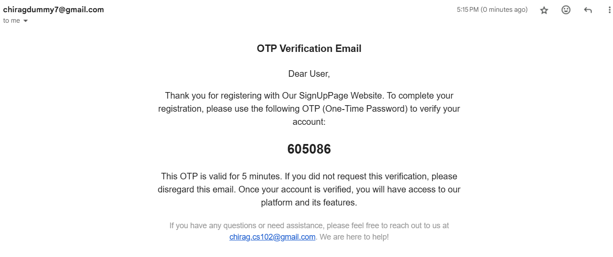

Login Page also have forget password page button, which sends mail to reset password.
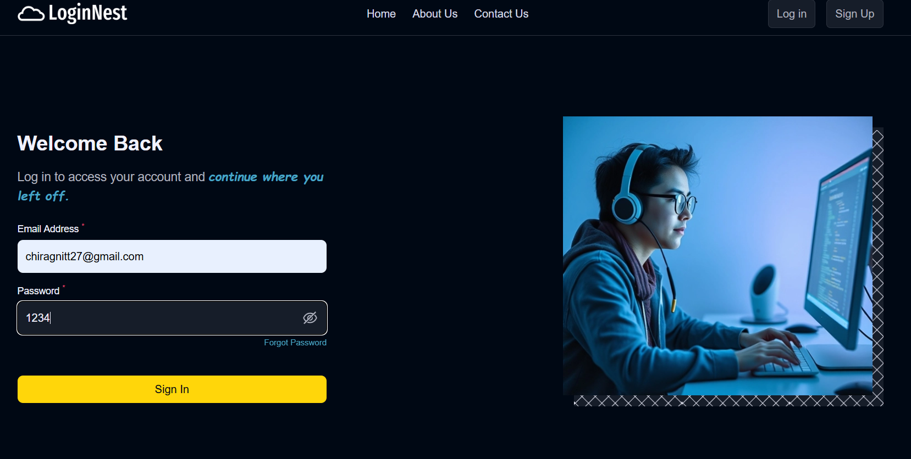

Dashboard After Login where you can see their profile picture, about and personal detials
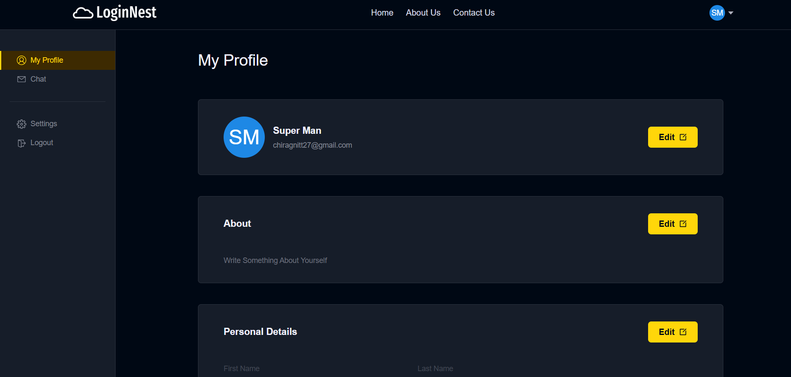
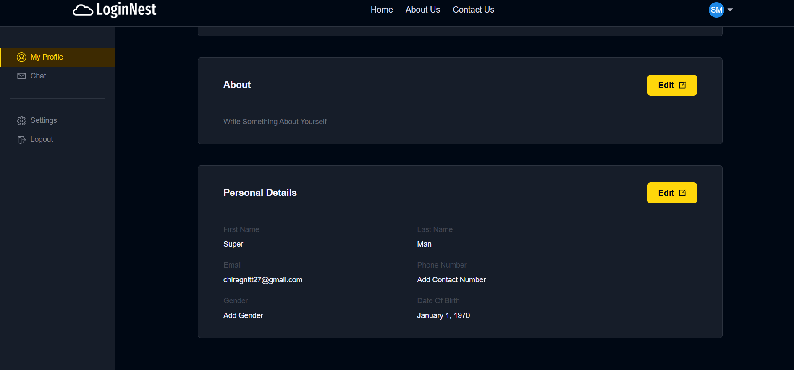

Setting page where user update their profile picture, personal details and password.
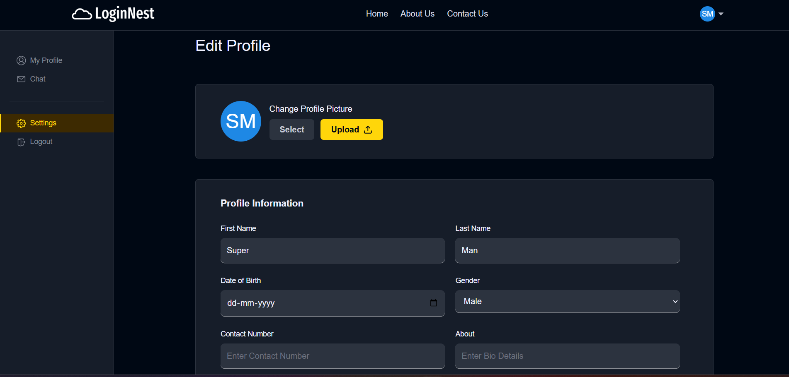
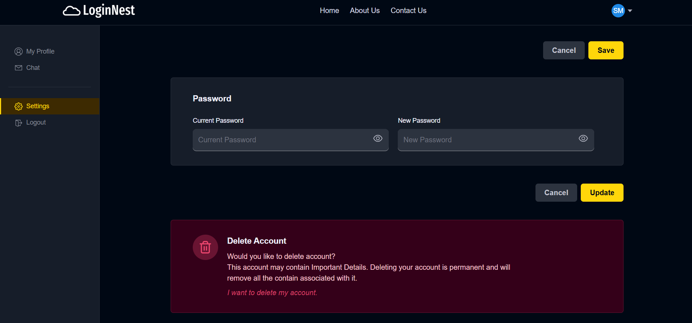

Chat Application
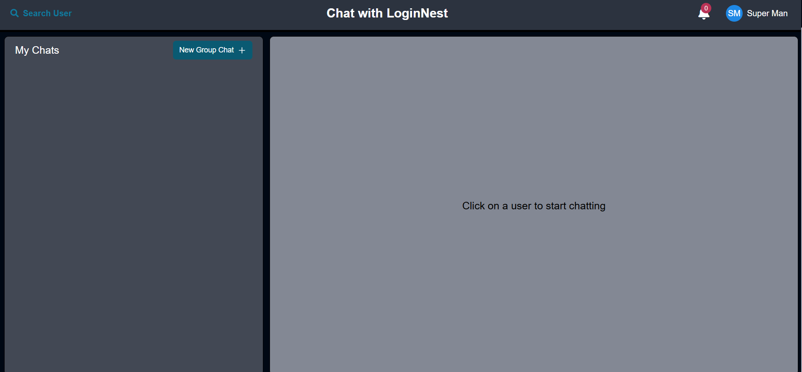

[Download and watch the demo of complete chat Application Part](videos/ChatDemo.mp4)

Update :- Also added google signin using passport.js
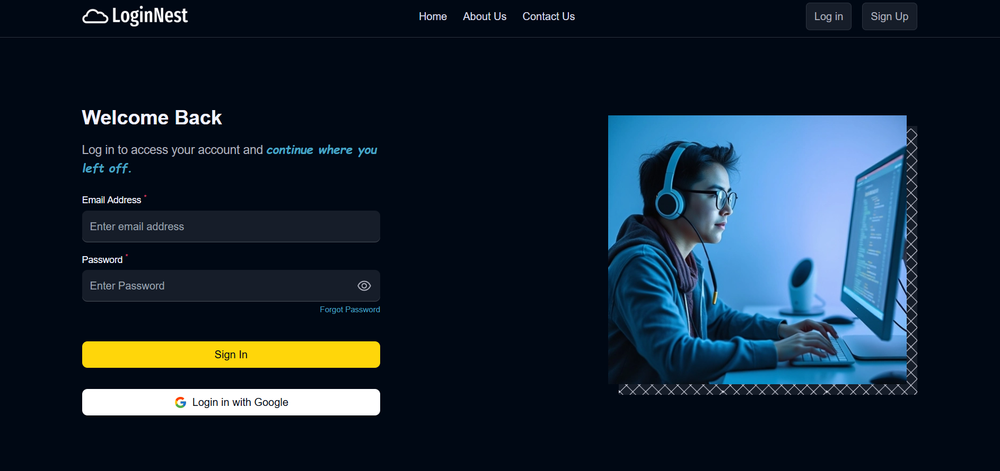
