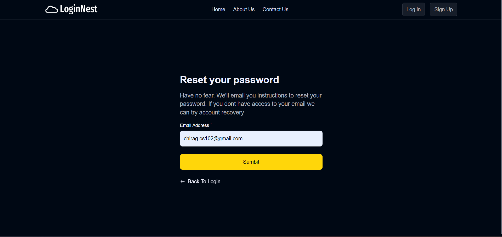
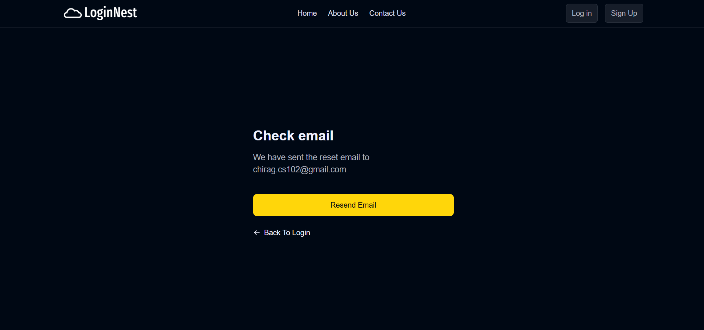
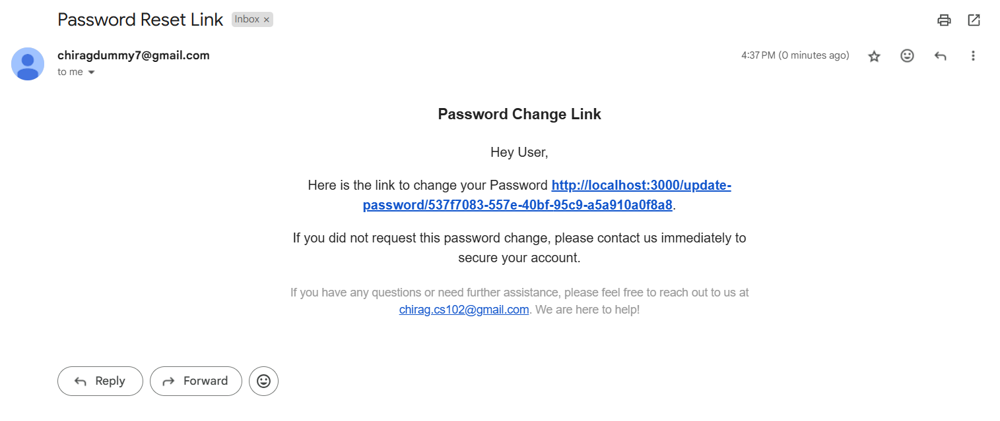
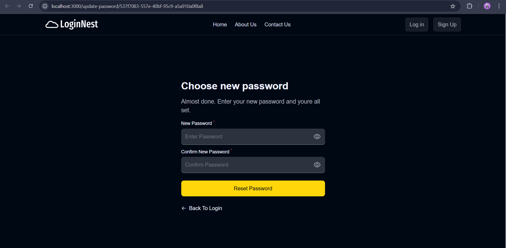

# Run Locally for the First Time

## Clone the Project

```bash
git clone https://github.com/ChiragOnGitHub/ChatApp.git
```

## Navigate to the Project Directory

```bash
cd ChatApp
```

## Install Dependencies

```bash
npm install
cd server
npm install
```

## Go Back to the Project Directory

```bash
cd ..
```

## Start the Website

```bash
npm run dev
```

---

# Environment Variables

Before running the project, create a `.env` file in the `server` directory. Add the following configuration variables:

```plaintext
# Mail Configuration for sending OTP
MAIL_HOST = <your_mail_host>
MAIL_USER = <your_email_address>
MAIL_PASS = <your_email_password>

# Authentication and Security
JWT_SECRET = <your_jwt_secret_key>
SESSION_SECRET = <your_session_secret_key>

# AWS S3 Configuration (i will use this in next commit )
AWS_REGION = <your_aws_region>
AWS_BUCKET_NAME = <your_aws_bucket_name>
AWS_ACCESS_KEY_ID = <your_aws_access_key_id>
AWS_SECRET_ACCESS_KEY = <your_aws_secret_access_key>

# Google OAuth Configuration
CLIENT_ID = <your_google_client_id>
CLIENT_SECRET = <your_google_client_secret>

# Database and Server Configuration
MONGODB_URL = <your_mongodb_connection_url>
PORT = 4000

# Additional Cloudinary (for user profile picture)
FOLDER_NAME = <your_folder_name>
CLOUD_NAME = <your_cloudinary_name>
API_KEY = <your_cloudinary_api_key>
API_SECRET = <your_cloudinary_api_secret>
```

---

# Demo

## Screenshots

### Home Page
Home page with an animation created using `react-animation-type`.


### About Us Page
The about us page contains information about the website for future purposes.


### Contact Us Page
The contact page sends a confirmation email to the user using `node-mailer` after receiving a message.


### Sign Up Page
Handles user errors with appropriate toast messages and sends an OTP to the user's email.


### Loading Page


### OTP Page


Here is how the OTP appears in the user's mail:


### Login Page


### Forget Password
Includes a "Forgot Password" button that sends a reset password link to the user's email.





### Dashboard
Displays the user's profile picture, about section, and personal details after login.


### Settings Page
Allows the user to update their profile picture, personal details, and password.


### Chat Application
basic features like sending text messages, emojis, and viewing chat history.

support group chat where we can add user and remove them.

admin can toggle whether newer members can see chat history or not.

Enable users to upload and download files within a workspace using aws s3 bucket


[Download and watch the demo of the complete chat application](screenshot/ChatDemo.mp4).

### Collaborative Document Editor
Integrate real-time collaborative document editing within workspaces.
Support simultaneous editing by multiple users with change tracking.

[Download and watch the demo of the complete collaborative document editing](screenshot/DocumentDemo.mp4).

### Google Sign-In
Added Google Sign-In functionality using `passport.js`.

